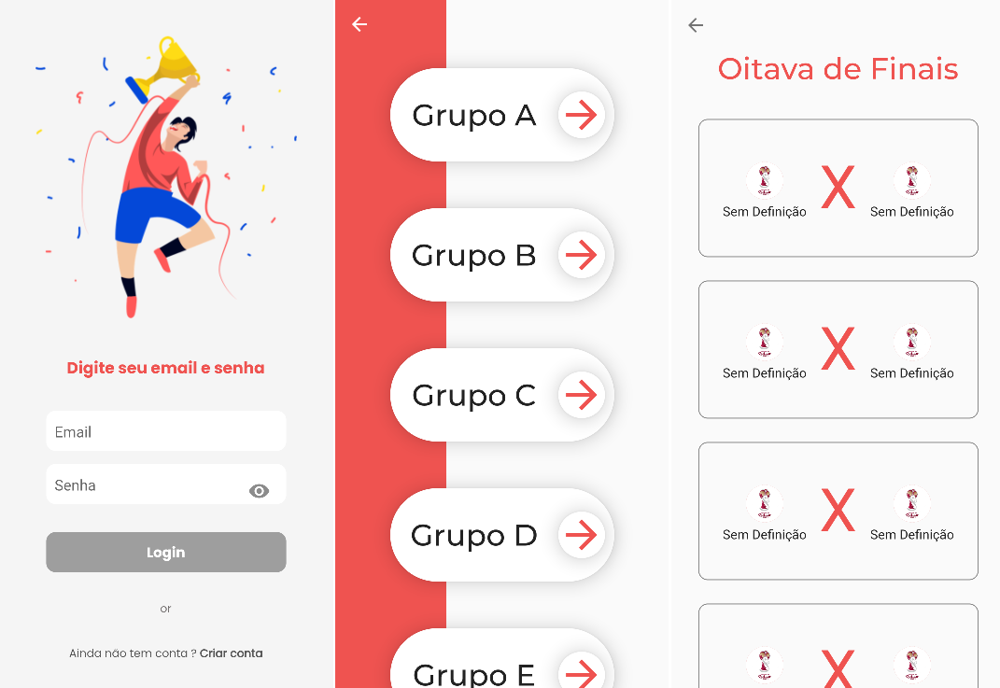

# ConsultaCopa2022



> Projeto tem como objetivo apenas ser um app para acompanhamento da copa do mundo de 2022.

### Ajustes e melhorias


## 💻 Pré-requisitos

Antes de começar, verifique se você atendeu aos seguintes requisitos:
* Você instalou a versão mais recente de `<Flutter / Firebase Auth / http >`
* Você tem uma máquina `<Windows / Linux >`.

## 🚀 Instalando ConsultaCopa2022

Para instalar o ConsultaCopa2022, siga estas etapas:

Rodando via App:

Se vc preferir executar sem ter que criar um usuario, deixamos disponivel o usuario: teste@teste.com, senha: 123456789


Apenas clone este repositorio para a sua maquina e execute pelo android studio selecionando um celular disponivel
```
Esse projeto foi desenvolvido usando como base o Pixel 6 
mas como foi seguido as melhores praticas de desenvolvimento deveria 
funcionar normalmente em qualquer outro dispositivo
```

Rodando via Chrome:
Apenas clone este repositorio para a sua maquina e execute pelo android studio selecionando o Chrome como um device

```
Devido a um problema com a API para poder rodar esse App no Chrome 
precisa primeiro desabilitar uma configuração de segurança do Chrome
"--disable-web-security", isso acontecer devido a API da web que estou 
usando não ter o CORS corretamente configurado
```

## ☕ Usando ConsultaCopa2022

Para usar ConsultaCopa2022, siga estas etapas:

```
<exemplo_de_uso>
```

Adicione comandos de execução e exemplos que você acha que os usuários acharão úteis. Fornece uma referência de opções para pontos de bônus!

## 📫 Contribuindo para ConsultaCopa2022
Para contribuir com ConsultaCopa2022, siga estas etapas:

1. Bifurque este repositório.
2. Crie um branch: `git checkout -b <nome_branch>`.
3. Faça suas alterações e confirme-as: `git commit -m '<mensagem_commit>'`
4. Envie para o branch original: `git push origin ConsultaCopa2022`
5. Crie a solicitação de pull.

Como alternativa, consulte a documentação do GitHub em [como criar uma solicitação pull](https://help.github.com/en/github/collaborating-with-issues-and-pull-requests/creating-a-pull-request).

## 🤝 Colaboradores

Agradecemos às seguintes pessoas que contribuíram para este projeto:

<table>
  <tr>
    <td align="center">
      <a href="#">
        <br>
        <sub>
          <b>Wellington Brito</b>
        </sub>
      </a>
    </td>
  </tr>
</table>


## 😄 Seja um dos contribuidores<br>

Quer fazer parte desse projeto? Clique [AQUI](CONTRIBUTING.md) e leia como contribuir.

## 📝 Licença

Esse projeto está sob licença. Veja o arquivo [LICENÇA](LICENSE.md) para mais detalhes.

[⬆ Voltar ao topo](#nome-do-projeto)<br>
